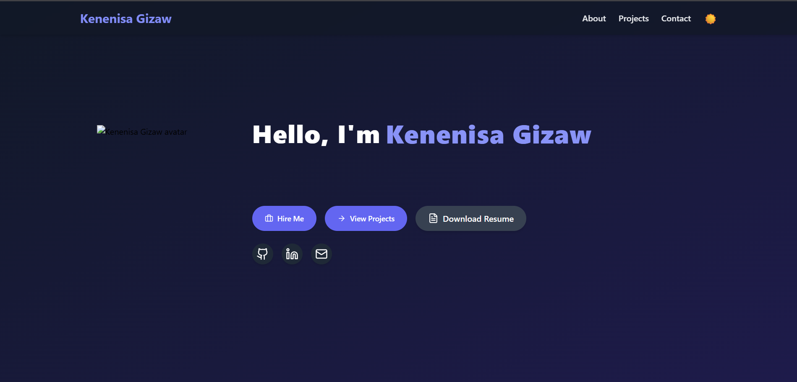

# 🚀 Kenenisa Gizaw's Portfolio

[](https://your-vercel-url.vercel.app)
[](LICENSE)

---

## 🖼️ Preview



---

## 🛠️ Technologies Used

- **HTML5**  
- **CSS3**  
- **Responsive Design**  
- **Vercel** (Deployment)

---

## ✨ Features

- Responsive design with mobile-friendly navigation  
- Transparent fixed navbar with hamburger menu on mobile  
- Social media sidebar with interactive icons  
- Contact form with email and phone details  
- Clean semantic HTML and CSS only (no JavaScript)  
- Deployed on Vercel for fast global delivery

---

## 🚀 Getting Started

### Installation

```bash
git clone https://github.com/kenenisagizaw/my-portfolio.git
cd my-portfolio
```

Open `index.html` in your browser to view the site locally.

### Deployment

1. Push your code to a GitHub repository.
2. Connect the repository to [Vercel](https://vercel.com/).
3. Choose "Other" as the framework preset.
4. Deploy and enjoy!

---

## 📁 Folder Structure

```
.
├── index.html
├── style.css
├── assets/
│   ├── myportfollio.png
│   ├── portfolio.png
│   └── weather app.png
└── README.md
```

---

## 🔮 Future Improvements

- Add JavaScript for enhanced interactivity (e.g., form validation)
- Integrate backend to handle contact form submissions
- Add more projects with live demos and descriptions
- Improve accessibility and SEO optimizations

---

## 📬 Contact

- **Email:** kenenisagizaw.28@gmail.com
- **GitHub:** [github.com/kenenisagizaw](https://github.com/kenenisagizaw)
- **LinkedIn:** [linkedin.com/in/kenenisagizaw](https://linkedin.com/in/kenenisagizaw)

---

## 📝 License

This project is licensed under the MIT License. See the [LICENSE](LICENSE) file for details.